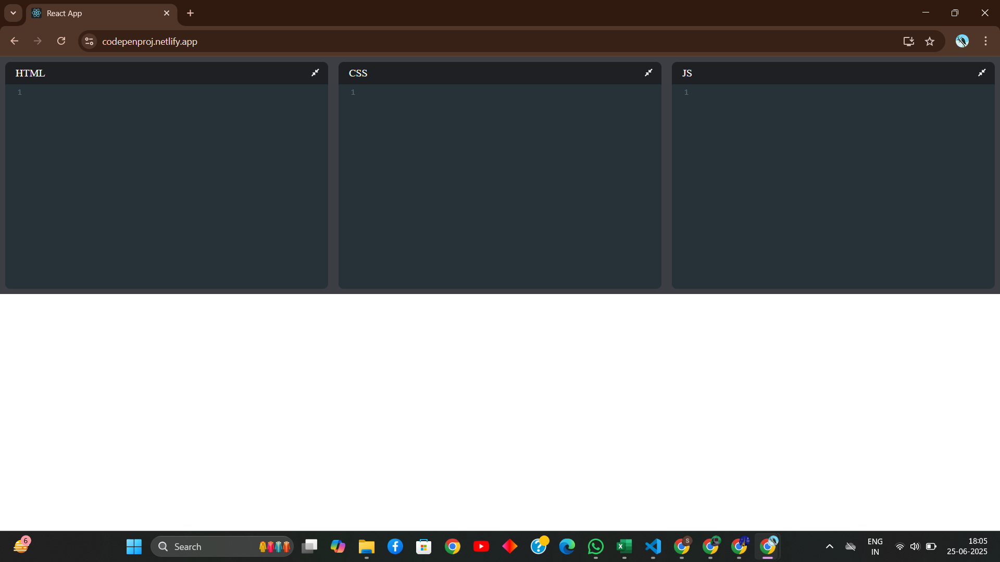
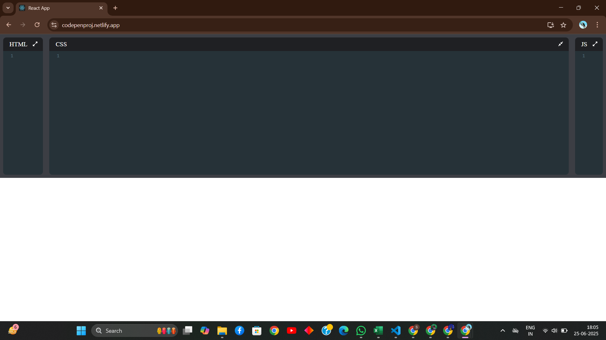
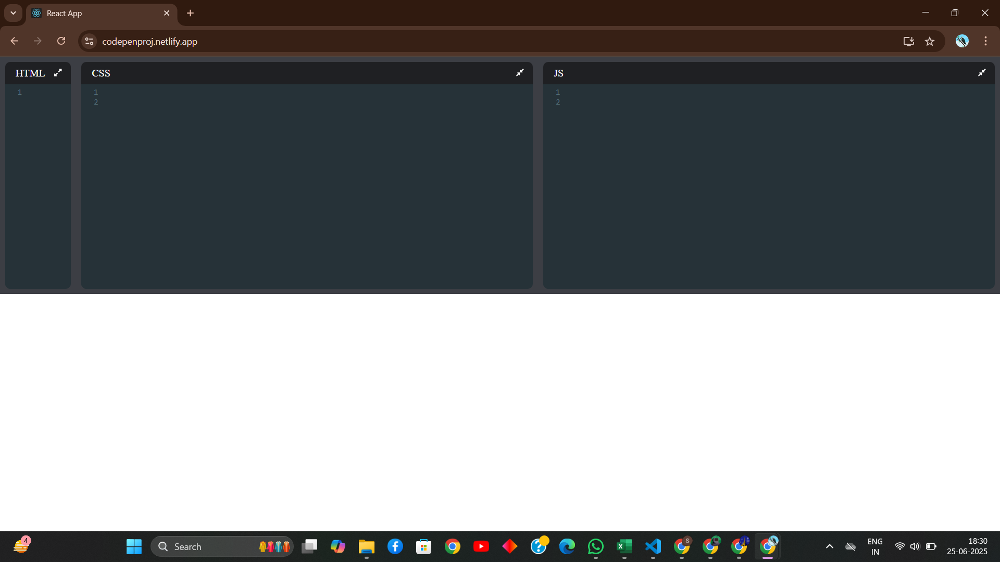
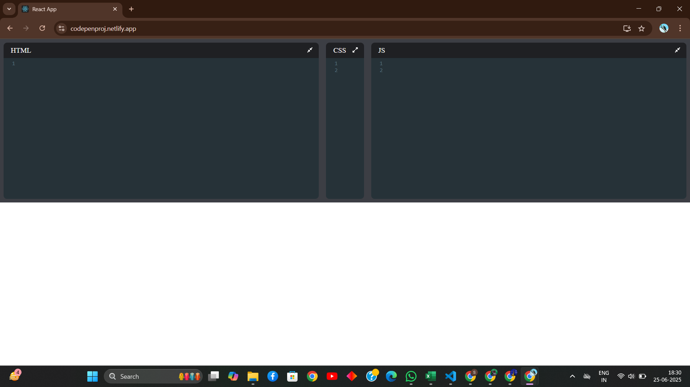
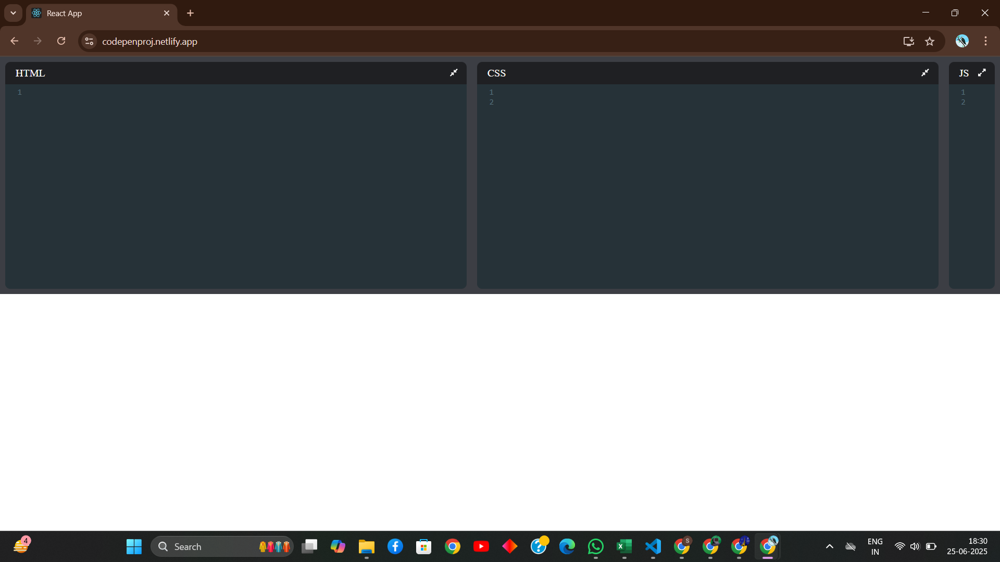

# Code Pen

A React-based Code Pen clone that allows users to write HTML, CSS, and JavaScript in separate panels and see a live preview in real-time. Built as a front-end portfolio project to demonstrate editor integration, state management, and live preview rendering.

---

## Table of Contents

- [Project Overview](#project-overview)
- [Live Demo](#live-demo)
- [Screenshots](#screenshots)
- [Technologies Used](#technologies-used)
- [Features](#features)
- [Project Structure](#project-structure)
- [Setup & Installation](#setup--installation)
- [Usage](#usage)
- [Future Improvements](#future-improvements)
- [Contact](#contact)
- [License](#license)

---

## Project Overview

**CodePen** replicates the core functionality of CodePen, providing three code editors (HTML, CSS, and JavaScript) with syntax highlighting and a live preview pane. This project demonstrates:

- Integration of CodeMirror in React.
- State management for editor content.
- Dynamic generation of an iframe `srcDoc` for live rendering.
- Responsive, collapsible editor panes.
- Use of React hooks, component composition, and CSS for layout.

It serves as a learning exercise and as a showcase piece for front-end/interview portfolios.

---

## Live Demo

Try the live version here:

👉 https://codepenproj.netlify.app

*(Hosted on Netlify; updates automatically upon merging to the main branch if configured.)*

---

## Screenshots

### Full Layout

### Collapsed Editor Pane

### Collapsed HTML Pane

### Collapsed CSS Pane

### Collapsed JS Pane

---

## Technologies Used

- **React** – Frontend library for building UI components.
- **CodeMirror** + **react-codemirror2** – Integrated code editor with syntax highlighting.
- **FontAwesome** – Icons for toggle buttons.
- **HTML5 / CSS3 / JavaScript (ES6+)** – Core web technologies.
- **Flexbox / CSS Grid** – Responsive layout for editor and preview panes.
- **Netlify** – Deployment of the static React app.

---

## Features

- **Three separate editors** for HTML, CSS, and JavaScript with syntax highlighting.
- **Live preview** pane that updates in real-time as you type (debounced for performance).
- **Collapsible editor panes**: focus on a particular language by expanding or collapsing panels.
- **Responsive design**: adapts to different screen sizes.
- **Sandboxed iframe** for rendering user code safely (`sandbox="allow-scripts"`).
- **Clean, minimal UI** resembling CodePen’s core experience.

---

## Project Structure

